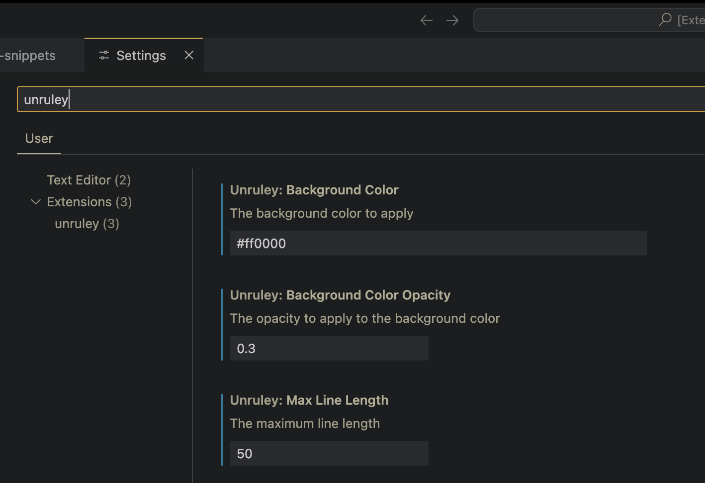
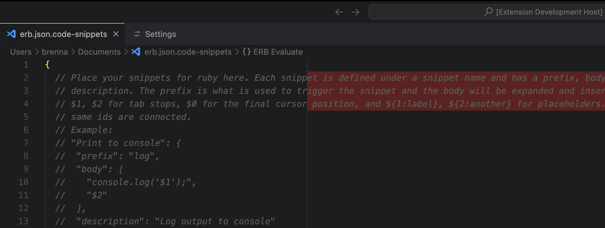

# Unruley VSCode Extension

Unruley is a Visual Studio Code extension that allows you to easily see where lines are exceeding a given maximum line length.

## Features

- Set a custom color.
- Set a custom opacity, or use the default of 0.1.
- Define a maximum line length for your code (or use one that's already been set).

The background color is automatically applied to lines that exceed the maximum line length, providing a helpful visual cue.

<figure>
  
  <figcaption align = "center"><b>Unruley Settings</b></figcaption>
</figure>
<figure>
  
  <figcaption align = "center"><b>Unruley In Action</b></figcaption>
</figure>

## Future Features

- Allow users to set and update settings per workspace.

## Usage

1. Install the extension.
2. Open the settings:
  - File > Preferences > Settings
  _or_
  - Mac: <kbd>⌘</kbd> + <kbd>⇧</kbd> + <kbd>P</kbd> (Command + Shift + P)
  - Windows: <kbd>^</kbd> + <kbd>⇧</kbd> + <kbd>P</kbd> (Ctrl + Shift + P)
3. Search for <kbd>Unruley</kbd>.
4. Set your preferred background color. [Click here to use Google's color picker](https://g.co/kgs/qeFDYUT). You can use hex (e.g., `#RRGGBB` or `#RGB`) or rgb (e.g., `rgb(255, 0, 0)`) color formats.
5. Set the background color opacity.
6. Set the maximum line length.

## Commands

- `unruley`: Open the settings for this extension.

## Configuration

- `unruley.ruler`: Set the maximum line length. Default is `80`.
- `unruley.rulerColor`: Set the background color. Accepts hex (e.g., `#RRGGBB` or `#RGB`) or rgb (e.g., `rgb(255, 0, 0)`) color formats. Default is `#ff0000`.
- `unruley.rulerColorOpacity`: Set the opacity of the background color. Accepts a number between `0` (completely transparent) and `1` (completely opaque). Default is `0.1`.

## Support

Questions? Comments? Concerns? Ideas? Visit the [Unruley discussions board](https://github.com/brennacodes/unruley/discussions).

## Contributing

Ready to dive in and contribute? Check out the [Contributing Guide](./CONTRIBUTING.md).

## License

[GPL v3.0](./LICENSE) © Brenna Stuart